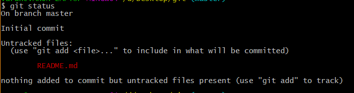
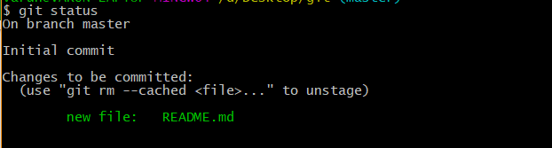
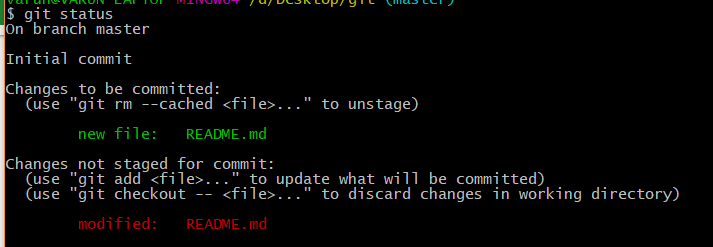
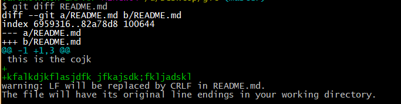
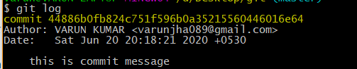

# Introduction to Git

## Introduction to Git

In this scenario, you are a project lead in an IT company. You and your team are working on a huge project, which 
consists of multiple functionalities and modules. This project is evolving over time and so your team is expecting 
a lot of code revisions. In this lab, you'll learn how to use a distributed version control system called Git. 
You'll also discover how to connect to a VM instance, install Git, and configure your Git user information. 
Next, you'll create a local Git repository, add a file to the repository, and do some basic operations like adding a 
file, editing files, and making commits.

## Install Git

Before you install Git on your Linux VM, you need to first make sure that you have a fresh index of the packages 
available to you. To do that, run:
    
    sudo apt update
    
Now, you can install Git on your Linux host using apt by running the following command:
    
    sudo apt install git
    
For any prompts, continue by clicking Y.

Check the installed version of git by using the command below:

    git --version
    
## Initialize a new repository

Create a directory to store your project in. To do this, use the following command:

    mkdir my-git-repo
    
Now navigate to the directory you created.

    cd my-git-repo
    
Next, initialize a new repository by using the following command:

    git init
    
The **git init** command creates a new Git repository. In our case, it transformed the current directory into a Git repository. 
It can also be used to convert an existing, unversioned project to a Git repository or to initialize a new, empty repository.

Executing **git init** creates a **.git** subdirectory in the current working directory, which contains all of the necessary Git 
metadata for the new repository. This metadata includes subdirectories for objects, refs, and template files. A HEAD 
file is also created which points to the currently checked out commit.

If you've already run **git init** on a project directory containing a **.git** subdirectory, you can safely run **git init** again 
on the same project directory. The operation is what we call idempotent; running it again doesn't override an existing 
**.git** configuration.

## Configure Git

Git uses a username to associate commits with an identity. It does this by using the **git config** command. To set Git 
username use the following command:

    git config --global user.name "Name"
    
Replace **Name** with your name. Any future commits you push to GitHub from the command line will now be represented by this 
name. You can use git config to even change the name associated with your Git commits. This will only affect future commits 
and won't change the name used for past commits. e.g.,

    git config --global user.name "VARUN KUMAR"

Let's set your email address to associate it with your Git commits.

    git config --global user.email "your@email.com"
    
Replace **your@email.com** with your email-id. Any future commits you now push to GitHub will be associated with this email 
address. You can even use git config to change the user email associated with your Git commits.

## Git Operations

Let's now create a text file named README. We will be using the nano editor for this.

    vim README.md
    
To type any text within the file press `i` and then insert text:

    This is my first commit
    
save the file by pressing `ESC` key and then `:wq`. Note that `:`  `w` `q` are three separate 
commands. 

|   key	|   Task it does	| 
|---	|---	|
|   `:`	|   starts taking the arguments.	|  
|   `w`	|   writes the file and saves it.	|   
|   `q`	|   to exit the file. 	|   

Git is now aware of the files in the project. We can check the status using the following command:
    
    git status
    
This command displays the status of the working tree. It also shows changes that have been staged, changes that haven't 
been staged, and files that aren't tracked by Git.

You can now see the file you created, README, under the section **Untracked files**. Git isn't tracking the files yet. To 
track the files, we have to commit these files by adding them to the staging area.

Now let's add the file to the staging area using the following command:

    git add README
    
This command adds changes from the working tree to the staging area i.e., it gathers and prepares files for Git before 
committing them. In other words, it updates the index with the current content found in the working tree to prepare the 
content that's staged for the next commit.

You can now view the status of the working tree using the command: **git status**. This now shows the file **README.md** 
in green i.e., the file is now in the staging area and yet to be committed.
 

However, **git add** doesn't affect the repository in any serious way because changes are not actually recorded until you commit them.

Let's now commit the changes. A Git commit is equivalent to the term "Save".

Commit the changes using the following command:

    git commit
    
This now opens an editor, asking you to type a commit message. Every commit has an associated commit message. A commit 
message is a log message from the user describing the changes.

Enter the commit message of your choice or use the following text:

    This is my first commit!
    
**`It is better to enter some meaningful message.`**

Once you have entered the commit message, save it by pressing `Ctrl-o` and Enter key. To exit click `Ctrl-x`.

The git commit command captures a snapshot of the project's currently staged changes i.e., it stores the current 
contents of the index in a new commit along with the commit message.

Let's now re-edit the file again to understand the process better. Open the file README.md using vim editor.

    vim README.md
    
Now add some text and save the file using `:wq`. Now, let's repeat the previous process. As mentioned earlier, you can 
always check the status of your repository by using:

    git status
    

Git tracks the changes and displays that the file has been modified. You can view the changes made to file using the following command:

    git diff README.md
    

You can see the differences between the older file and the new file. New additions are denoted by green-colored text 
and a + sign at the start of the line. Any replacements/removal are denoted by text in red-colored text and a - sign at 
the start of the line.

Now, we will add these changes to the staging area.

    git add README
    
View the status of the repository using the following command:

    git status
    
Git now shows the same file in green-colored text. This means the changes are staged and ready to be committed.

Let's commit the file now by entering the commit message with the command itself, unlike the previous commit. This is 
easiest way to commit the changes.

    git commit -m "This is my second commit."
    
The command **git commit** with -m flag takes the commit message, too. This is different to the command without flag, where 
you had to type the commit message within the editor. If multiple **-m** flags are given to the command, it concatenates 
the values as separate paragraphs.

To view all the commits use the following command:

    git log
    

Git log command shows the commit history of the repository. It shows all the commits on the repository represented by a 
unique commit ID at the top of each commit. It also shows the author, date, and time and the commit message associated 
with the commits.

You also have various options to limit the output of this command. The output can be filtered based on the last number 
of commits, author, commit message, etc.